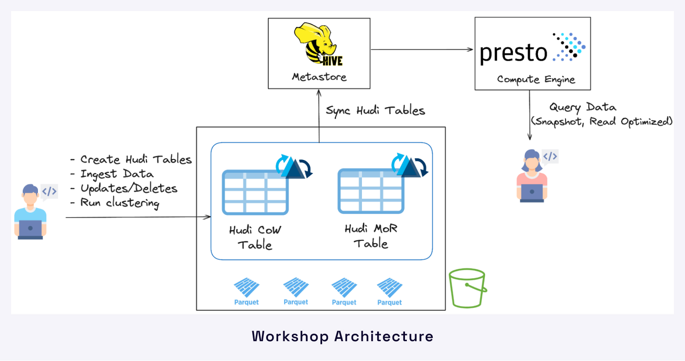

# Building an Open Data Lakehouse on AWS S3 with Apache Hudi & Presto
---
In this hands-on workshop, we'll learn how to build a open lakehouse architecture using `Apache Hudi`, `PrestoDB` on a cloud data lake `Amazon S3`. Additonally, we will take advantage of Hudi's `metadata table` and `clustering` table service to optimally organize data in S3.

## Dataset
The workshop will leverage a 1 GB TPC-DS dataset to demonstrate the various capabilities of `read` and `write` operations with Hudi and Presto. The dataset is made available at a common S3 location (`s3://presto-workshop-bucket`) accessible to workshop attendees.

## Environment Details
All the required open source software and its dependencies will be pre-installed for the workshop session. Attendees will use `Jupyter Notebook` to run various read and write queries on Apache Hudi using Presto and Spark SQL. Users will also have access to Presto UI for additional analysis and debugging.

## Description
The lakehouse architecture combines the flexibility, scalability, and cost-efficiency of data lakes with the robust data management features of data warehouses. This workshop is designed to provide data engineers & architects with a comprehensive understanding of Apache Hudi and use it to build an open lakehouse architecture on AWS S3, utilizing Presto as the engine for fast and interactive queries.

## Key Takeaways
### Attendees will learn about:
- Open Lakehouse architecture stack with Hudi as the transactional layer & Presto as the compute engine.
- Hudi’s Table optimization service - Clustering & Metadata tables to help improve query performance.
- Practical exercises on creating different Hudi tables (CoW, MoR) on S3, ingesting data, performing upserts/deletes, and synching with catalogs such as Hive Metastore.
- Various ways of querying data using Presto including snapshot and read-optimized queries.
- Application of clustering table service & metadata table to observe firsthand improvements in query speed on the Presto-side.

## Housekeeping Rules
- 3 Sections in sequence - (spend ~30-40 mins each)
- Attendees are expected to follow the instructor in each section but are free to execute code on their own
- Navigate to `/notebooks/` & you will see the `Hudi_Presto_Workshop.ipynb` file
- Attendees SHOULD NOT CREATE any additional notebooks other than the ones provided in their environment
- Attendees will follow a particular section until they reach the allotted time
- Instructor will wait for 50%+ attendees to finish a section; then go on to the next section
- For any questions/issues, attendees are encouraged to put it in the Zoom Chat
- Attendees that need detailed troubleshooting can join the Slack channel: `hudi-presto-workshop-04-24` (PMC members for help)
- For Slack Huddle, attendees will need to get out of Zoom & rejoin after the Huddle
- The Cluster will be available for 2 hours post workshop
- Be patient with the Queries - Hard to strike a sweet spot between scale & latency

## Getting Started
1. Login to jupyter[X].onehouseworkshop.com (X - will be a number assigned & unique to you. Please DO NOT USE any other numbers)
2. Navigate to `/notebooks/` & you will see the `Hudi_Presto_Workshop.ipynb` file
3. Open the Notebook to follow the workshop instructor in executing the code
4. The `/notebooks/commons/` folder will contain another notebook `HudiUtilityFunctions.ipynb`. This is where we have all the utility functions
5. Please DO NOT create any additional notebook with Spark running
